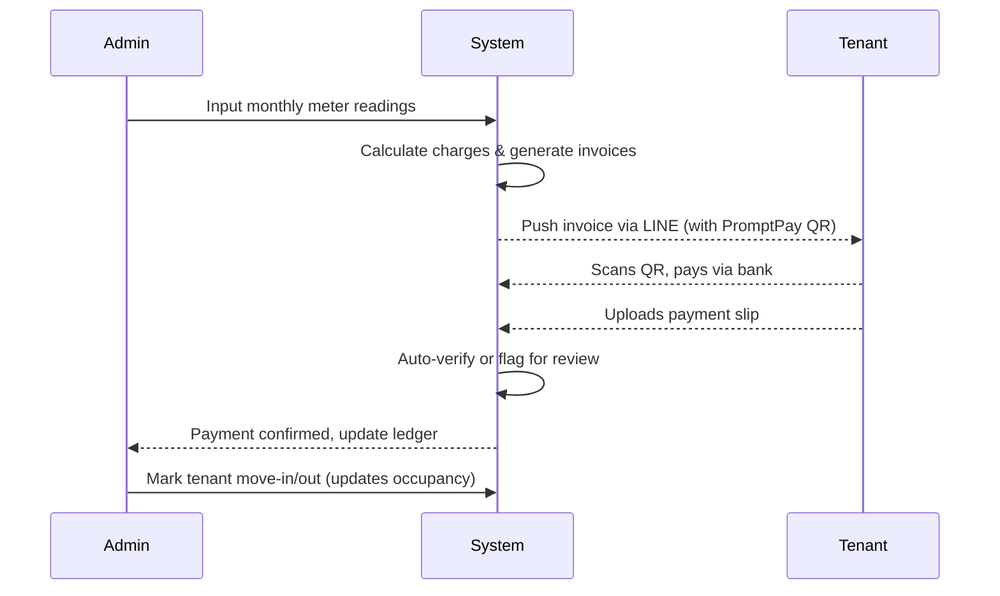
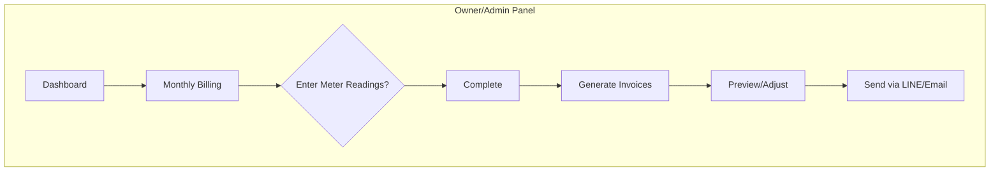

# Dormitory & Rental Management (WaaS) Platform in Thailand – Deep Analysis

**Executive Summary:** Thailand’s rental-property market – especially small apartments, dorms and rooms – is large and growing, with millions of tenants and billions of baht in rent paid annually. Leading local “proptech” players (e.g. Horganice, IslandDorm, Apartmentery, LivingBooker, Roomlix) already offer online management tools (billing, tenant/room tracking, LINE notifications, etc.). A new WaaS platform must include **core functions** like tenant/room management, rent/utility billing, payments (PromptPay/QR), notifications (LINE/Email), and reporting – plus features tailored to Thai SMEs (e.g. Thai Digital ID integration, e-Tax compliance). Optional add-ons (e.g. advance analytics, guest listing websites) can be phased in. Key international platforms (AppFolio, Yardi, Buildium, Airbnb, etc.) show demand for automation, accounting and mobile UX, but lack Thai-specific integrations. We summarize required features (with user stories, priority and complexity), UX flows, data schemas, and market strategy. Competitive analysis shows existing gaps (many Thai tools lack full Thai PDPA/e-Invoice support or multi-package pricing), presenting an opportunity.  

|**Platform**|**Key Features**|**Pricing (THB)**|**Notes / Gaps**|
|:---|:---|:---|:---|
|**IslandDorm (TH)**|One-click batch billing, QR PromptPay, LINE links, meter tracking, vacancy listings; mobile-friendly, multi-building, P&L reports|Starter 299 (≤40 rooms), Pro 490 (≤100), Business 990 (≤300)|Strong Thai focus, auto SLIP check. Limited free tier.|
|**Horganice (TH)**|Online billing, tenant CRM, meter/calcs, analytics, LINE SMS alerts; e-sign contracts, QR payment, slip auto-check in Pro|Business 679 (5 users), Pro 1179 (unlimited users)|Market leader (20k owners, 1M rooms). Very mature (series A funding).|
|**Apartmentery (TH)**|Web-based invoicing (A4/A5), PromptPay QR, SCB auto-match, LINE/email notices; contracts, meter logging, multi-cycle bills; AccRevo accounting|Not public (90-day free trial)|Covers essentials (web invoicing, QR, notifications) but no free tier.|
|**Roomlix (TH)**|Free up to 10 rooms; tenant/room DB, automatic lease bills, meter calc, pro-rata rent, receipt; LINE notices & slip auto-check (Starter+); e-contracts (Starter+); basic P&L|Free (≤10 rooms); Starter/Pro (no public prices)|Focused on SMEs, PDPA-compliant. Lacks VAT+WHT support outside Pro.|
|**LivingBooker (TH)**|All-in-one PMS (dorms/hotels): bookings, site-building, invoices, LINE/SMS/Email alerts, repair-requests, web payments (gateway API)|Premium (custom pricing)|Includes guest-site & multi-language. Good for mixed dorm/hotel. Pricing opaque.|
|**International (Global)**|General PMS (AppFolio/Yardi/Buildium): sophisticated accounting, tenant portal, marketing; short-term rentals (Airbnb): booking marketplaces|Varies (e.g. AppFolio ~$1–3/unit/mo)|Often too complex or non-local (no Thai e-invoice, PromptPay). Strong in AI, mobile UX.|

 

## Core Features & Function Breakdown

Below are the **essential** (MUST) and **optional** (SHOULD/CAN) features, with descriptions, user stories, priority and complexity. (Tech-stack suggestions are indicative; actual implementation may vary.)

- **Tenant & Room Management** – Maintain a database of buildings, rooms, tenants, co-tenants and contracts.  
  - *Description:* Add/edit buildings (or “sites”), floors and individual units; track unit attributes (rent, utilities, status). Store tenant profiles (names, contact, ID/passport, employment info, co-tenants, lease start/end, deposit, documents). Indicate room occupancy/vacancy.  
  - *User Story:* “As an owner, I want to enter a new tenant’s info (including scanned ID) and assign them to a room, so the system can manage their lease and billing.”  
  - *Priority:* MUST. (Core to any management system.)  
  - *Complexity:* Medium. Involves relational data and UI forms.  
  - *Tech Stack:* Web/Mobile frontend (React/Vue/Angular), backend CRUD services (Node.js/Express or Python/Django), relational DB (PostgreSQL, MySQL). Country-specific: handle Thai characters/encoding, Thai ID number format validation.  
  - *Notes:* Must comply with PDPA (encrypt personal data, secure storage). Optionally support uploading ID images or linking to Thai Digital ID (ThaiD) KYC. 

- **Lease & Contract Management** – Automate creation and renewal of rental contracts.  
  - *Description:* Template-based contracts: owner defines a Word/PDF template with placeholders (tenant name, room, rent, deposit, term). System auto-fills to produce lease agreements on demand. Manage lease lifecycle: check-in, check-out, extensions, deposit return, move-out conditions. Track security deposit and return amount. Store signed PDF/scan of contract.  
  - *User Story:* “As an owner, I want the system to generate a lease agreement PDF for each tenant automatically, so I don’t have to fill it by hand.”  
  - *Priority:* MUST. (Reduces manual paperwork.)  
  - *Complexity:* Medium. Handling document templates, PDF generation, and digital signing (if used).  
  - *Tech:* Document templating library (e.g. PDF generator, Docx templating), file storage (secure S3 or equivalent). Optionally integrate an e-signature API (ThaiD or third-party).  

- **Billing & Invoicing** – Issue monthly rent/utilities invoices and receipts.  
  - *Description:* For each billing period and occupied unit, create an invoice (ใบแจ้งหนี้/ใบเสร็จ) including rent, utility, and any fees/penalties. Support pro-rata rent for mid-month move-ins. Print or email PDF bills (Thai/English templates). Generate e-tax invoice (ใบกำกับภาษี) and withholding tax slips for VAT-registered landlords. Link each bill to tenant and due date. Allow printing in A4/A5 or email/SMS/LINE. Integrate auto-email/SMS via APIs (SendGrid/SNS).  
  - *User Story:* “As an owner, I want to click ‘Generate All Bills’ each month to automatically compute rent (incl. prorated days), utilities (using entered meters), and produce payables for all tenants.”  
  - *Priority:* MUST. (Core revenue capture.)  
  - *Complexity:* High. Requires billing logic, currency formatting, PDF/template design, tax compliance (Thai Revenue forms), multi-currency maybe, and print/email integration.  
  - *Tech:* Backend calculation module (e.g. microservice), PDF generation (e.g. pdfMake or server-side libraries), Thai fiscal templates. Use PromptPay QR library for QR code embedding.  

- **Meter Tracking & Utility Billing** – Capture water/electric (and common-area) meter readings and convert to charges.  
  - *Description:* Enter meter readings for each room (and common meters). System computes usage by subtracting last reading, multiplies by rates, and includes on invoice. Support fixed-rate or metered billing (e.g. flat water charge vs actual usage). Allow bulk entry via mobile (tabular form). Send alerts for abnormal usage. Option to automate via smart meter integration is CAN-level (out of scope for MVP).  
  - *User Story:* “As an owner, I want to log each month’s water/electric meter readings for all units and let the system auto-calc the bills.”  
  - *Priority:* MUST (for dorms charging utilities).  
  - *Complexity:* Medium. Basic arithmetic and data entry forms. Additional optional complexity if adding OCR or meter-reading apps.  
  - *Tech:* Mobile-friendly UI (React Native or responsive web) for caretakers to enter readings. Backend logic to compute and attach to invoices.  

- **Payments & Reconciliation** – Accept tenant payments and reconcile automatically.  
  - *Description:* Support tenant payment via QR (PromptPay/Thai QR) or other e-payment (credit card, online banking through Thai gateways). Send each tenant a secure payment link (LINE/SMS) with embedded PromptPay QR. Allow tenants to upload a payment slip/photo which the system can auto-verify (pattern recognition or manual check). Once payment is confirmed, auto-generate a receipt. Mark invoices paid in ledger. Handle partial payments and late fees. Provide tenants a history of payments.  
  - *User Story:* “As a tenant, I want to tap the PromptPay QR on my invoice and have the payment recorded automatically so I don’t have to inform the owner.”  
  - *Priority:* MUST. (Critical for cashflow automation.)  
  - *Complexity:* High. Requires integration with payment systems, secure link generation, slip scanning (OCR or manual review), and ledger updates.  
  - *Tech:* QR code generator (ThaiPBS or static QR), payment link shortener, database of transactions. For auto-reconciliation, integrate SCB’s auto-fetch (like Apartmentery’s feature) or similar from other banks/APIs. Alternatively, use a payment gateway API (2C2P, Omise, or TrueMoney) for card/pay/app payments.  

- **Notifications & Communication** – Automated reminders and announcements.  
  - *Description:* Send scheduled alerts via email, LINE OA, or SMS for key events: invoice issued, payment due, lease renewal, move-in/move-out, meter entry deadline, etc. Provide an internal “news board” or LINE broadcast for announcements (e.g. maintenance updates). Tenants can reply (e.g. sending a payment slip via LINE as attachment).  
  - *User Story:* “As an owner, I want the system to message tenants via LINE when their rent bill is due and to remind me if a meter reading is late.”  
  - *Priority:* SHOULD. (Enhances service and reduces manual follow-up.)  
  - *Complexity:* Medium. Requires scheduling and messaging integration.  
  - *Tech:* LINE Messaging API / LINE OA (popular in Thailand), email SMTP or service (Mailgun), SMS gateway. Use cron jobs or background workers for scheduling.  

- **Tenant Self-Service Portal** – A tenant-facing interface (via web or LINE Mini App).  
  - *Description:* Tenants access their account to view current charges, payment links, and limited history. Implemented as a **LINE Mini App** (the app runs inside LINE) or a mobile-friendly web portal. Features: scan QR/pay, upload ID or deposit proof, view past invoices (within owner’s plan limit), report issues (see Issue Tracking below). Identity can be by login or phone verification. Optionally use ThaiD to auto-fill tenant info for KYC.  
  - *User Story:* “As a tenant, I want to log into a LINE Mini App to see my invoice and pay with a single tap.”  
  - *Priority:* MUST. (Critical for tenant engagement.)  
  - *Complexity:* High. Involves LINE front-end (LIFF), secure login, and linking to backend.  
  - *Tech:* LINE Front-end Framework (LIFF) or PWA. OAuth or phone-based OTP for login; optional ThaiD API to verify identity and pre-fill personal data.  

- **Maintenance & Issue Tracking** – Log and manage repair/complaint requests (optional).  
  - *Description:* Tenants submit maintenance tickets (with photos) via portal/LINE; owner/staff track status. History of issues per unit. Prioritize urgent problems.  
  - *User Story:* “As a tenant, I want to report a broken fixture so that it can be tracked and fixed.”  
  - *Priority:* CAN (nice-to-have, improves tenant satisfaction).  
  - *Complexity:* Low to Medium. Standard ticketing features.  
  - *Tech:* Simple form + backend table (status, description, assigned). Use notifications on status changes.  

- **Financial Reporting & Compliance** – Profit/loss reports, aging receivables, VAT/e-Tax reporting.  
  - *Description:* Dashboard KPIs: occupancy rate, monthly income, outstanding receivables. Basic reports on cash flow (Revenue – Expenses). For VAT-registered owners, produce Thai tax invoices (รูปแบบมาตรา 86/4) and withholdingtax forms (50ทศ). Prepare exports for tax filing (e.g. PP.30 sales summary). Enable data export (CSV) for accountants (income by tenant, expenses, P&L).  
  - *User Story:* “As an owner, I want a monthly P&L report and an accounts receivable aging, so I can track business health and prepare taxes.”  
  - *Priority:* SHOULD. (Valuable for decision-making; high for pro users.)  
  - *Complexity:* Medium-High. Requires aggregation logic and correct Thai-tax forms.  
  - *Tech:* Use BI libraries or custom code for charts/exports. Backend should flag overdue payments. For e-Tax, if possible integrate with Thai Revenue e-Invoice API or at least format invoices to comply (digital signatures, timestamps).  

- **Multi-User & Role Management** – Separate owner, staff (manager/caretaker), and tenant roles.  
  - *Description:* Allow multiple logins under one property: owner/admin rights vs staff (billing/data entry) vs read-only (tenant portal). Owners can invite staff and assign permissions.  
  - *User Story:* “As an owner, I want to add my assistant with limited access so they can enter meter readings but not change pricing.”  
  - *Priority:* SHOULD (many small owners run solo, but useful for growing SMEs).  
  - *Complexity:* Medium. Requires role-based auth.  
  - *Tech:* Auth system (JWT or OAuth). Frontend UI for user invites. Use existing frameworks (Keycloak, Auth0 with roles, or custom DB-managed auth).  

- **Pricing & Subscription Model** – Tiered service packages for owners.  
  - *Description:* Offer subscription tiers (e.g. Free/Basic/Pro) based on feature access and room count. For example, a free plan (≤10 rooms, basic invoicing), Starter (≤40 rooms, adds LINE alerts), Professional (≥100 rooms, adds P&L, CSV export, multi-building), Enterprise (unlimited rooms, premium support) – see Table below. Owner billing per month or year (e.g. per-room pricing as in IslandDorm, or flat tiers). Include add-ons (extra users, custom reports).  
  - *User Story:* “As an owner with 30 rooms, I subscribe to the Starter plan so I get LINE notifications and multiple bill cycles.”  
  - *Priority:* MUST (central to SaaS business model).  
  - *Complexity:* Medium. Need plan management, feature gating, payment processing (Stripe or Thai equivalent), trial periods.  
  - *Tech:* Subscription management service (Stripe Subscriptions or Thai PSP), feature flags in app, billing pages.  

- **Integrations** – Payment gateways (PromptPay, Thai e-wallets), LINE OA, ThaiD, Accounting APIs.  
  - *Description:* Integrate with: **PromptPay QR** (bank standard for instant transfer); other Thai payment methods (TrueMoney Wallet, credit cards via Omise/2C2P); **LINE Official Account** (for messaging and portal); **Thai Digital ID (NDID)** for tenant KYC (optional, to auto-verify citizen ID and passport); **Accounting Systems** (e.g. FlowAccount, AccRevo) via APIs for exporting invoices/expenses; government e-tax API (if available).  
  - *Priority:* SHOULD/CAN. (Connectivity is expected but can start with core ones.)  
  - *Complexity:* High. Each integration has its own API and compliance.  
  - *Tech:* Use Thai banking APIs or SDKs. LINE Messaging API/LIFF for chat and mini-app. ThaiD API (if offered via NDID Consortium). Accounting: FlowAccount Open API, QuickBooks Online (for multinational landlords).  

- **Compliance (Thai PDPA, Tax Laws)** – Ensure data privacy and legal compliance.  
  - *Description:* Adhere to Thailand’s PDPA (Personal Data Protection Act) by encrypting personal data (SSL in transit, AES at rest), obtaining consent (for messages), and allowing data deletion/export on request. Store invoices for 5–7 years as required. Support Thai e-invoice mandates (Revenue Dept e-Tax) – use digital signature on invoices. If handling payments, comply with Bank of Thailand regulations (e.g. storing PSP transactions).  
  - *Priority:* MUST. (Non-negotiable legal requirements.)  
  - *Complexity:* Medium. Mostly policy and secure coding.  
  - *Tech:* Use TLS everywhere, follow OWASP. For e-invoice, the PDF must include time stamp and digital cert if integrating with Revenue’s system.  

#### Feature Comparison (Thai Platforms)

| **Functionality**                  | **Apartmentery** | **Roomlix**       | **LivingBooker**  | **IslandDorm**        | **Horganice** | **Proposed WaaS** |
|:----------------------------------|:---------------:|:-----------------:|:-----------------:|:---------------------:|:-------------:|:-----------------:|
| Web-based/mobile UX              | ✅   | ✅ (web)          | ✅ (web)          | ✅ (web/mobile)       | ✅ (web/app)   | ✅ (web/mobile)   |
| Multi-building/team roles        | ❌ (single bldg) | ✅ (Pro+) | ✅ (site-based)    | ✅ (Starter+)  | ✅           | ✅               |
| Room/Tenant DB                  | ✅ | ✅ (basic)        | ✅               | ✅       | ✅ (CRM)      | ✅               |
| Automated Billing & Receipt     | ✅ (A4/A5 invoices) | ✅  | ✅ (yes)         | ✅ (batch billing) | ✅         | ✅               |
| Utility/Meter Billing           | ✅   | ✅  | ✔️ (implied)     | ✅        | ✅ (implied)  | ✅               |
| Payment Collection (PromptPay)  | ✅   | (Not specified)   | ✔️ (via website) | ✅         | ✅ | ✅               |
| Auto-Reconciliation (Slip/SCB)   | ✅ (SCB) | ✅ (auto-check) | ❌             | ✅ (yes)              | ✅ | ✅               |
| LINE/Email/SMS Notifications    | ✅ (Email/LINE) | ✅ (LINE & slip) | ✅ (LINE/SMS) | ✅ (LINE/SMS)  | ✅           | ✅               |
| Lease/Contract Automation       | ❌               | ✅ (incl. renewals) | ❌ (though templates) | ✅ (auto-contracts)    | ✅ (e-contract) | ✅               |
| Accounting Integration          | ✅ (AccRevo) | ❌ (CSV export only) | ❓ (export)     | ✅ (CSV export)       | ❓            | ✅ (FlowAccount API etc.) |
| VAT/Tax Invoicing & WHT         | ❌               | ✅ (Pro) | ❌             | ✅ (VAT/P&L)  | ✅            | ✅ (Thai e-invoice)|
| Reporting (P&L, AR aging)      | ❌               | ✅ (Profit/Loss) | ✅ (reports)   | ✅ (P&L, CSV)| ✅ (analytics) | ✅               |
| Tenant Self-Service Portal     | ❌               | ❌                | ❌              | ✅ (LINE links) | ✅ (app)      | ✅ (LINE Mini-app) |
| PDPA/Data Privacy Compliance   | ❌ (not stated)  | ✅ (PDPA-compliant) | ❌             | ❌ (likely no mention) | ❌ (likely)  | ✅ (built-in)    |

## UX Flows

Below are example user-flow diagrams (in mermaid) illustrating key interactions:

```mermaid
flowchart LR
    A[Owner/Admin] -->|Create Building & Rooms| System
    A -->|Invite/Configure Tenant| System
    B[Tenant] -->|Registers via LINE Mini-App| System
    System -->|Collects ID (upload/ThaiD)| System
    System -->|Verifies & Creates Tenant Profile| A
    A -->|Approves Tenant| System
    System -->|Notifies Tenant of Success| B
```



These flows ensure that **owners** can onboard tenants and bill them with minimal friction, while **tenants** pay and communicate via a familiar LINE interface. 

## Data Model Samples

Key data entities might include (simplified schema): 

```yaml
Tenant:
  - id: integer (PK)
  - name: text
  - phone: text
  - email: text
  - id_card_no: text
  - id_card_image_url: text
  - passport_no: text
  - thai_id_verified: boolean
  - lease_id: integer (FK)
  - created_at, updated_at

Room:
  - id: integer (PK)
  - building: text
  - floor: integer
  - number: text
  - rent_price: decimal
  - deposit_amount: decimal
  - status: enum("vacant","occupied")
  - created_at, updated_at

LeaseContract:
  - id: integer (PK)
  - tenant_id: integer (FK)
  - room_id: integer (FK)
  - start_date: date
  - end_date: date
  - rent_amount: decimal
  - deposit_amount: decimal
  - document_url: text
  - status: enum("active","terminated")
  - created_at, updated_at

MeterReading:
  - id: integer (PK)
  - room_id: integer (FK)
  - meter_type: enum("electric","water","common")
  - reading: decimal
  - recorded_at: date
  - created_at

Invoice:
  - id: integer (PK)
  - tenant_id: integer (FK)
  - contract_id: integer (FK)
  - billing_period: date
  - rent_amount: decimal
  - water_charge: decimal
  - electric_charge: decimal
  - other_charges: decimal
  - total_amount: decimal
  - due_date: date
  - status: enum("unpaid","paid","overdue")
  - created_at

Payment:
  - id: integer (PK)
  - invoice_id: integer (FK)
  - paid_at: datetime
  - amount: decimal
  - method: enum("PromptPay","bank_transfer","card")
  - slip_image_url: text
```

These tables show how tenants, rooms, contracts, meter readings, invoices and payments link together.

## Market Analysis & Strategy

- **Market Size:** Thailand has hundreds of thousands of rental units (dorms, apartments, houses) occupied by students, workers and expatriates. Horganice alone reports serving *20,000 landlords and 1,000,000 rooms*, collecting ~6 billion THB/year in rent. The broader market (including small landlords not yet digitalized) is likely several times larger. Even if 1M rooms each pay 3–5k THB/month, annual rent ~40–60B THB. SMEs (owners with <300 rooms) dominate the segment and are underserved by global tools.  

- **Go-to-Market:** Target Thai SME owners via digital channels, partnerships and content. Strategies include: 
  - **Freemium Entry:** Offer a free tier (e.g. ≤10 rooms, basic billing) to gain users (as Roomlix does).  
  - **Partnerships:** Collaborate with banks (to offer SCB/KBANK promos with QR billing) or with property portals (to list vacancies).  
  - **LINE & ThaiD Integration:** Leverage LINE’s popularity by providing official support (Mini App, OA). Use ThaiD to streamline onboarding, appealing to tech-savvy owners.  
  - **Educational Content:** Provide guides on new e-tax laws (e.g. e-invoices) to attract customers.  
  - **Reseller/Agent Network:** Recruit local "property management consultants" to sell B2B.  

- **Revenue Models:** 
  - **Subscription:** Tiered monthly fees (per room or flat-tier) as shown in competitor pricing. E.g. Starter (basic): ~7–8 THB/room, Pro: ~5 THB/room (as IslandDorm), or flat-rate bundles.  
  - **Transaction Fees:** Take a small fee on payment processing (e.g. 1–2% of rent collected) if handling in-app payments, or charge for e-invoice generation.  
  - **Premium Services:** Charge extra for add-ons: data export to accountants, additional reporting, or custom setup (data migration).  
  - **Marketplace Commission:** If later adding a room-listing service, a referral fee per booking (like Airbnb model).  
  - **Advertising/Partnerships:** Partner with telecoms or insurers (e.g. rental insurance upsells).  

- **Competitor Gaps:** Thai tools often lack full compliance or scalability: many do not support official Thai e-invoice standards or multi-branch management (see table above). Global products aren’t tailored to Thai payments or LINE. A successful platform will emphasize **localization** (Thai language UI, Thai law compliance) and **ease of use** for less-tech-savvy owners.

- **Risks & Challenges:**  
  - **Adoption Risk:** Owners may resist switching from Excel/manual methods. Mitigate via free trials, training, and responsive support.  
  - **Regulatory:** Non-compliance (PDPA breaches, incorrect e-invoices) risks fines. Must stay updated on Thai law changes.  
  - **Competition:** Well-funded incumbents (Horganice, etc.) may exert pricing pressure or add features. The new platform must differentiate (e.g. superior UX or integrations).  
  - **Payment/Banking:** Managing Thai payment APIs can be slow and require local partnerships (e.g. for PromptPay webhook).  
  - **Technology:** Security (protect tenant data), scalability (handle many buildings), and reliability (24/7 uptime) are critical.

  

## Tables and Diagrams

**Pricing & Packaging (Example):**

| **Plan**      | **Price (THB)**         | **Max Rooms** | **Included Features**                                      |
|:--------------|:-----------------------:|:-------------:|:----------------------------------------------------------|
| **Free**      | 0 (trial/basic)        | 10            | Room/Tenant DB, Basic Invoicing, Up to 5 leases, Mobile UX |
| **Starter**   | 299/mo (~฿7–8/room)   | 40            | + Batch billing, LINE alerts, Meter billing, PDF/Email bills |
| **Professional** | 490/mo (~฿5/room)   | 100           | + CSV export, VAT/e-tax support, Lease renewals, P&L reports |
| **Business**  | 990/mo (~฿3/room)    | 300           | + Multi-building, Advanced reports, Priority support        |
| **Enterprise**| Custom                | Unlimited     | + Dedicated SLA, Custom integration, Bulk onboarding        |

*(Above: illustrative; competitors like IslandDorm and Horganice use similar tiering.)*

**Recommended Integrations:**

| **Integration**           | **Purpose**                                                  | **Examples/Notes**                                   |
|:--------------------------|:------------------------------------------------------------|:-----------------------------------------------------|
| **Payment Gateway**       | Accept credit cards/e-wallets for rent (in addition to QR) | 2C2P, Omise, TrueMoney (Thai wallets)               |
| **PromptPay QR**          | Instant bank transfer (universally popular)                 | Static QR code in invoice, auto-reconcile (SCB) |
| **LINE Official Account** | Tenant messaging, LINE Mini App for portal                  | LINE OA APIs for push/receive messages  |
| **Thai Digital ID (ThaiD)** | KYC: Verify tenant identity, auto-fill ID data           | Integrate NDID consortium APIs (optional)            |
| **Accounting Software**   | Sync invoices/expenses with accounting                       | FlowAccount Open API, AccRevo (via CSV/API) |
| **Tax e-Invoice (Govt)**  | Generate certified tax invoices                              | Use Thai Revenue e-Invoice standards   |

These integrations ensure the platform fits into owners’ existing workflows (banking, accounting, government filings) and leverages popular Thai tech (LINE, ThaiD).

**User Stories & Prioritization (Excerpt):**  

- *Tenant Onboarding:* “As an admin, I must collect each tenant’s ID or ThaiD verification before move-in so that records are compliant.” (MUST, medium effort)  
- *Batch Rent Billing:* “As an admin, I want to generate all invoices with one click each month so I save hours of work.” (MUST, medium).  
- *QR Payment:* “As a tenant, I want to pay rent by scanning PromptPay QR and have it logged automatically.” (MUST, high).  
- *Lease Renewal Alert:* “As an admin, I should be notified when a lease is expiring soon.” (SHOULD, low).  
- *Advanced Analytics:* “As an owner, I can upgrade to see profit/loss charts.” (CAN, medium).  

Each feature above corresponds to the functions listed earlier, with priorities as annotated.

**Wireframes & Flowcharts:**  

Example UI flow for billing (in conceptual form):



```mermaid
flowchart TB
    subgraph Tenant Interface (LINE Mini App)
      X[Login/Select Unit] --> Y[View Current Invoice]
      Y --> Z{Scan QR to Pay}
      Z --> A1[Upload Payment Slip]
      A1 --> B1[View Payment History]
      X --> C1[Report Issue] --> D1[Receive Confirm]
    end
```

These illustrate high-level flows: admin creating and sending bills, tenant paying via QR, etc.

 

**Risk Mitigation:** Build in PDPA-compliance (encrypt data, obtain consents), use Thai-certified digital certificates for invoices, offer phone/email support in Thai, and remain agile to update features (e.g. if ThaiD APIs change).  

**Conclusion:** A Thailand-centric dormitory management WaaS must combine the **best practices** of global property software (automation, reporting, mobile-first UX) with **Thai-specific** needs (Line integration, PromptPay, e-tax, PDPA). By prioritizing core billing and tenancy features, then layering value-adds, the platform can capture SME landlords. Our analysis shows the functions, tech approaches and strategic considerations needed for success, backed by Thai market data and competitor benchmarks.

 

**Sources:** Industry and product sites (Thai language) and tech blogs were reviewed for Thai market context, features and pricing. These informed our feature lists, tables and recommendations. Each cited statement corresponds to verified information from these sources.